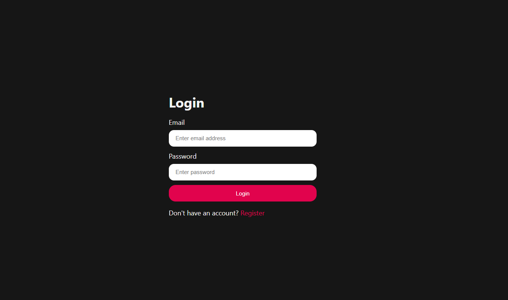
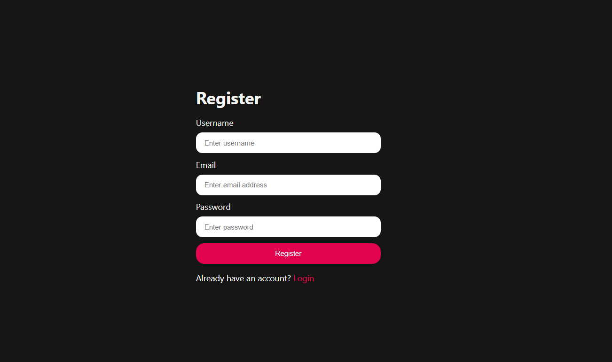
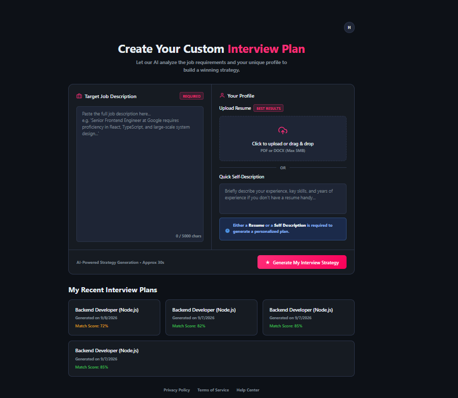
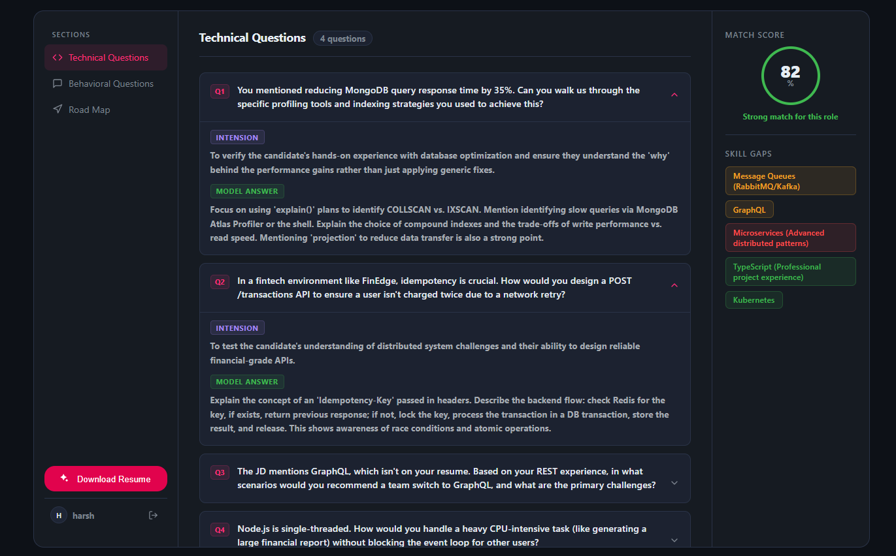

# AI Interview Prep

> Generate a personalized interview strategy — technical questions, behavioral questions, skill-gap analysis, and a day-by-day preparation roadmap — from your resume, self-description, and a target job description.


---

## Overview

AI Interview Prep analyzes a candidate's resume (or a quick self-description) against a target job description using Google's Gemini API, then produces a structured interview report:

- **Match score** — how well the candidate's profile fits the role
- **Technical questions** — tailored to the resume and job, with interviewer intent and model answers
- **Behavioral questions** — with intent and suggested answers using frameworks like STAR
- **Skill gap analysis** — missing skills ranked by severity
- **Day-by-day preparation roadmap** — a focused study plan before the interview
- **AI-tailored resume PDF** — generate and download a resume rewritten for the specific job description

---

## Screenshots

| Login | Register |
|---|---|
|  |  |

| Home |
|---|
|  |

| Interview Report |
|---|
|  |

---

## Tech Stack

**Frontend**
- React 19 + Vite
- React Router 7
- Sass (SCSS)
- Axios

**Backend**
- Node.js + Express 5
- MongoDB + Mongoose
- JWT authentication with token blacklisting (logout invalidation)
- Multer (resume file uploads)
- `pdf-parse` (resume text extraction)
- Puppeteer (AI-tailored resume PDF generation)
- Google GenAI SDK (`@google/genai`) — Gemini for report generation
- Zod (schema validation)

**Deployment**
- Render (Web Service — backend, Static Site — frontend)

---

## Project Structure

```
GenAI-Project/
├── Backend/
│   ├── src/
│   │   ├── config/          # database connection
│   │   ├── controllers/     # route handlers
│   │   ├── middlewares/     # auth, file upload
│   │   ├── models/          # Mongoose schemas
│   │   ├── routes/          # Express routers
│   │   ├── services/        # Gemini AI integration
│   │   └── app.js
│   └── server.js
│
└── Frontend/
    └── src/
        ├── features/
        │   ├── auth/         # login, register, auth context/hooks
        │   └── interview/    # home, interview report, interview context/hooks
        └── style/            # SCSS files
```

---

## Getting Started

### Prerequisites

- Node.js 18+
- A MongoDB database (local or Atlas)
- A Google Gemini API key

### 1. Clone the repository

```bash
git clone https://github.com/harsh201045/GenAI-Project.git
cd GenAI-Project
```

### 2. Backend setup

```bash
cd Backend
npm install
```

Create a `.env` file in `Backend/`:

```env
PORT=3000
MONGODB_URI=your_mongodb_connection_string
JWT_SECRET=your_jwt_secret
GOOGLE_GENAI_API_KEY=your_gemini_api_key
NODE_ENV=development
```

Run the backend:

```bash
npm run dev
```

### 3. Frontend setup

```bash
cd Frontend
npm install
```

Create a `.env` file in `Frontend/`:

```env
VITE_API_BASE_URL=http://localhost:3000
```

Run the frontend:

```bash
npm run dev
```

The app will be available at `http://localhost:5173`.

---

## Authentication

- JWT is issued on login/register and stored in an `httpOnly` cookie.
- In production, cookies are set with `secure: true` and `sameSite: "none"` to support cross-origin requests between the deployed frontend and backend.
- On logout, the token is added to a blacklist collection so it can no longer be used, even if not yet expired.

---


